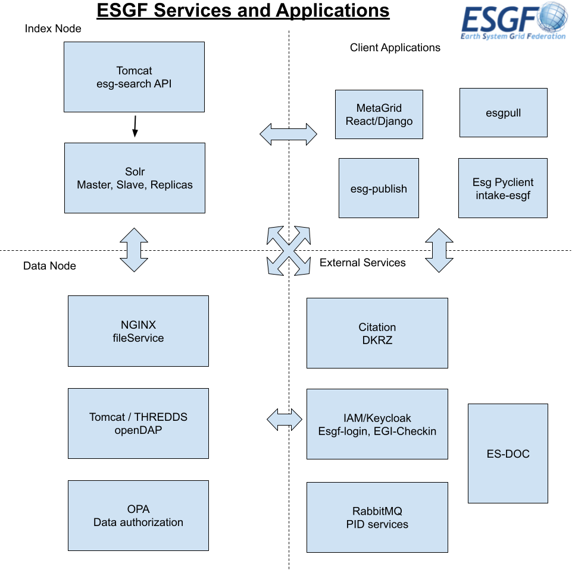

## ESGF Technical Overview

This document gives an architectural overview of the technical components of
The Earth System Grid Federation (ESGF). This may be a useful reference for
understanding the relationship between components of an installation, as well
as providing information about the purpose of each component and links to
relevant documentation pages and installation guides.

For a more general description of the purpose and high-level structure of the
federation, see [ESGF Federation Design].
For specific information on ESGF software packages documentaion sites and repositories, see [ESGF Software].

### Components

Information about the components from the diagram above, along with links to
the documentation for each (including installation instructions where
relevant).

#### ESGF Docker Managed Deployment

The ESGF Docker repository contains code and configuration for many key ESGF
services. These are largely refactored and containerised versions of legacy
ESGF components (e.g. components of the "index" and "data" nodes from the old
playbook), though some are brand-new.

Installation of these components is done via a Helm chart or with Ansible.

##### Data Node Services

  - Nginx file server (providing HTTP downloads)
  - THREDDS (providing OPeNDAP subsetting)

##### Index Node Services

  - "esg-search" Tomcat web app (providing a search and publication API)
  - SOLR (provides search index and search via replicas)

#### Other components

- Central Identity Services: 
  - login.esgf.io (IDP "proxy" providing login from multiple possible IDPs)
  - Globus Auth

- MetaGrid: Web UI

- RabbitMQ

[esgf federation design]:    {{site.url}}/federation-design.html
[esgf software]: {{site.url}}/software.html