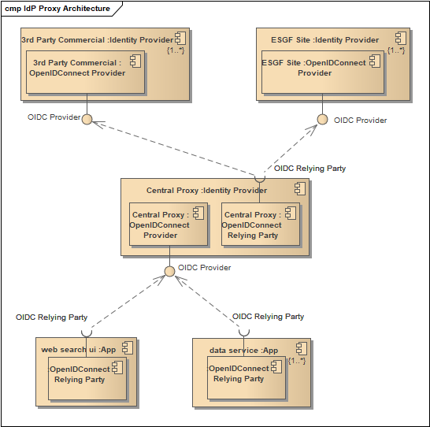
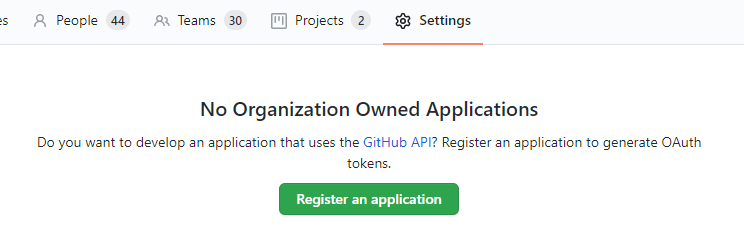
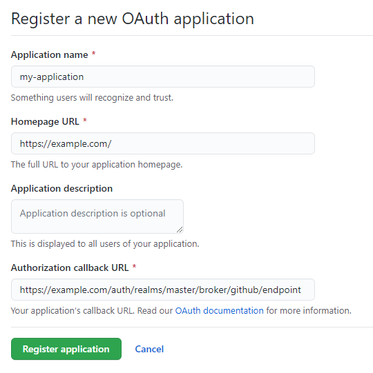
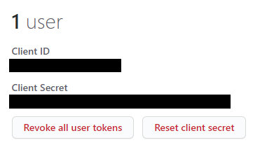

# Identity Provider Registration

## Introduction

This guide details the process for bootstrapping different layers of the ESGf identity management infrastructure. Specifically, the registration of client applications (*Relying Parties*) with identity management services (*Identity Providers*). We are using OpenID Connect on top of the OAuth 2 protocol to facilitate the sharing of identities between applications.

Keycloak, an open source and highly customisable identity management server, can act as both *Relying Party* and an *Identity Provider*. This is the technology we are using for the main components of the identity management system, the **IDP Proxy** and the organisation-specific **Local IDP** servers.

The diagram below shows the various components in this architecture. The connections between components are our use-cases:



## Actors

- **Relying Party (RP):**
  An OAuth 2.0 Client application that requires user authentication and claims from an Identity Provider. Relying Parties must register themselves with an Identity Provider to allow this interaction.
- **Identity Provider (IDP)**
  This is a trusted source of authority on user identity which communicates with a Relying Party using the OAuth 2.0 protocol.
- **Keycloak:**
  Keycloak is an identity management server written in Java. Its documentation can be found **here**.
- **Local IDP:**
  This is a Keycloak server installed on a node at an ESGF site and acting as an Identity Provider. It would be appropriately branded and provide login and registration for users at that site.
- **IDP Proxy:**
  This is a Keycloak server acting as the central identity management service for ESGF. While it facilitates login for ESGF users, it does not allow registration. Instead acting as proxy to multiple Local IDPs (hence "IDP Proxy") which provide it with user identities. This gives it access to all users in the federation, allowing it to be the Identity Provider for all ESGF applications.
- **Commercial IDP:**
  An Identity Provider not managed by ESGF but which could be hooked up to the IDP Proxy to provide additional login options for "homeless" users. e.g. GitHub, Google Plus, etc.
- **ESGF Application:**
  An application, typically a web application (e.g. COG), which may utilise user account information provided by the OpenID Connect protocol. This would be facilitated by acting as Relying Party to the IDP Proxy using some kind of OpenID Connect authentication library.
- **IDP Administrator:**
  A person with access to the administration backend of an Identity Provider. For example, somebody with access to the admin console of a Keycloak instance. This may also be the owner or an administrator of a GitHub organisation.
- **RP Administrator:**
  A person with access to the administration backend of a Relying Party. This could be the manager of a web application or the administrator of a Keycloak server that is behaving as a Relying Party.
- **Realm:**
  In Keycloak, a realm manages a set of users, credentials, roles, and groups. All interactions with a Keycloak server happen within the context of a realm.
- **Client:**
  In Keycloak, clients are entities that can request Keycloak to authenticate a user. All OAuth 2.0 flows happen via a client configured on an Identity Provider's server.
- **Keycloak API:**
  The Keycloak Admin REST API provides endpoints to manipulate a Keycloak realm. We are using it to automate the process of client registration.
- **Keycloak API User:**
  This is any Keycloak user with authority to use the Keycloak Admin REST API for a given realm.
- **Bearer Token:**
  This is a token included in an HTTP Authorization header that authorizes access to a particular resource or set of resources without the sender needing to prove their identity.

## Use cases

This document will detail the procedure for the following use-cases:

1. Registering the ESGF IDP Proxy with an organisation’s Local IDP

    **Relying Party**: Local IDP (Keycloak)
    **Identity Provider**: IDP Proxy (Keycloak)

2. Registering the ESGF IDP proxy with a Commercial IDP

    **Relying Party**: IDP Proxy (Keycloak)
    **Identity Provider**: Commercial IDP (e.g. GitHub)

3. Registering an ESGF application with the ESGF IDP Proxy

    **Relying Party**: An ESGF application (e.g. COG)
    **Identity Provider**: IDP Proxy (Keycloak)

## Setting up access to a Keycloak server’s REST API

*This section assumes you have access to a **Keycloak** server with an accessible **realm** (see **Installing Keycloak**)*

Before being able to use the API for a Keycloak installation, some setup must be performed by an administrator of that server.

1. The Keycloak administrator should create a dedicated *API user*. This account should have permission to access the *Keycloak API* for `<realm-name>` on the server.

2. Access to this *API user* should be granted to the person who wishes to use the API to, for example, register a *Relying Party* (e.g. an *RP administrator*).

    - Keycloak allows you to send a password reset email for a user via the admin interface. This makes it easy to grant accounts to other people.

3. With the credentials of this *API user*, we can now a request an API access token (*Bearer Token*):

    *Request*
    ```http
    Endpoint: https://keycloak.example.com/auth/realms/<realm-name>/protocol/openid-connect/token
    Method: POST
    Content-Type: application/x-www-form-urlencoded
    
    Data:
    client_id  = admin-cli
    grant_type = password
    username   = <user>
    password   = <password>
    ```

    *JSON Response*
    ```json
    {
        "access_token": "<access-token>",
        "expires_in": 60,
        "refresh_expires_in": 1800,
        "refresh_token": "<refresh-token>",
        "token_type": "bearer",
        "not-before-policy": 0,
        "session_state": "<session-state>",
        "scope": "profile email"
    }
    ```

4. Save the `<access-token>` from the response. This is our *Bearer Token*. It can be used until the expiry time (60 seconds, in this case) has passed.

The *Bearer Token* can now be used to access the Keycloak admin API to register clients or configure IDPs.

## Case 1: Registering the IDP Proxy with an organisation’s Local IDP

In this use case, the **Local IDP** is acting as an *Identity Provider* and the **IDP Proxy** is a *Relying Party*.

The first step is to establish access to the *Keycloak API*:

1. Fetch a *Bearer Token* from the *Local IDP* for the relevant *Realm*. (see ***Setting up access to a Keycloak IDP’s REST API***)

Now the *Keycloak API* for the *Local IDP*'s `<realm-name>` can be queried:

2. Register a new *Client*: 

    *Request*
    ```http
    Endpoint: https://localidp.example.com/auth/realms/<realm-name>/clients
    Authorization: Bearer <bearer-token>
    Method: POST
    Content-Type: application/json

    JSON:
    {
        "clientId": "<client-name>"
    }
    ```

    The response will be empty but a new *Client* will have been created on `<realm-name>`

3. Retrieve the `<unique-client-id>` using the `<client-name>`:

    *Request*
    ```http
    Endpoint: https://localidp.example.com/auth/realms/<realm-name>/clients
    Authorization: Bearer <bearer-token>
    Method: GET

    Query:
    clientId = <client-name>
    ```

    *JSON Response*
    ```json
    [
        {
            "id": "<unique-client-id>",
            "clientId": "<client-name>",
            ...
        }
    ]
    ```

4. Using `<unique-client-id>`, retrieve the `<client-secret>`:

    *Request*
    ```http
    Endpoint: https://localidp.example.com/auth/realms/<realm-name>/clients/<unique-client-id>/client-secret
    Authorization: Bearer <bearer-token>
    Method: GET
    ```

    *JSON Response*
    ```json
    {
        "type": "secret",
        "value": "<client-secret>"
    }
    ```

Now that the *Client* details have been retrieved, the last stage is to set up the new IDP in Keycloak based on the acquired credentials. This will require querying the *IDP Proxy's* *Keycloak API*.

5. Fetch a *Bearer Token* from the *IDP Proxy* for the relevant *Realm*. (see ***Setting up access to a Keycloak IDP’s REST API***)

6. Create a new Keycloak Identity Provider on `<idp-proxy-realm-name>` with the `<client-name>` and `<client-secret>`:

    *Request*
    ```http
    Endpoint: https://centralidp.example.com/auth/realms/<idp-proxy-realm-name>/identity-provider/instances
    Authorization: Bearer <bearer-token>
    Method: POST
    Content-Type: application/json

    JSON:
    {
        "alias": "<idp-alias>",
        "config":
        {
            "authorizationUrl": "https://localidp.example.com/auth/realms/<realm-name>/protocol/openid-connect/auth",
            "tokenUrl": "https://localidp.example.com/auth/realms/<realm-name>/protocol/openid-connect/token",
            "clientAuthentication": "jwt",
            "clientId": "<client-name>",
            "clientSecret": "<client-secret>"
        }
    }
    ```

    The response will be empty but a new *Identity Provider* will have been created on `<idp-proxy-realm-name>`

## Case 2: Registering the ESGF IDP proxy with a Commercial IDP

In this use case, a **Commercial IDP** is acting as an *Identity Provider* and the **IDP Proxy** is a *Relying Party*.

The first part of this process, the registration of our client, will differ depending on which provider you are using. Though, most will provide instructions.

In this example, we are using GitHub as the *Identity Provider*:

1. On your GitHub organisation's settings page, under "Developer settings", click the "OAuth Apps" button. This will let you register a new OAuth application, which is what we want.

    

2. The application must be configured with a name, a homepage URL and an authorization callback URL.

    

    The only important thing here is the callback URL, since this will be where users are redirected to once they have authenticated with their GitHub credentials. In our case, the authorization callback URL will be:

    `https://centralidp.example.com/auth/realms/<idp-proxy-realm-name>/broker/github/endpoint`

3. Selecting the application, you should be able to see its ID and secret:

    

Now that the *Client* has been set up and we have the ID and secret, the last stage is to configure a new IDP in Keycloak with these client details. This will require querying the *IDP Proxy's* *Keycloak API*:

4. Fetch a *Bearer Token* from the *IDP Proxy* for the relevant *Realm*. (see ***Setting up access to a Keycloak IDP’s REST API***)

5. Create a new Keycloak Identity Provider on `<idp-proxy-realm-name>` with the `<client-name>` and `<client-secret>`:

    *Request*
    ```http
    Endpoint: https://centralidp.example.com/auth/realms/<idp-proxy-realm-name>/identity-provider/instances
    Authorization: Bearer <bearer-token>
    Method: POST
    Content-Type: application/json

    JSON:
    {
        "alias": "<idp-alias>",
        "config":
        {
            "authorizationUrl": "https://localidp.example.com/auth/realms/<realm-name>/protocol/openid-connect/auth",
            "tokenUrl": "https://localidp.example.com/auth/realms/<realm-name>/protocol/openid-connect/token",
            "clientAuthentication": "jwt",
            "clientId": "<client-name>",
            "clientSecret": "<client-secret>"
        }
    }
    ```

    The response will be empty but a new *Identity Provider* will have been created on `<idp-proxy-realm-name>`

## Case 3: Registering an ESGF application with the ESGF IDP proxy

In this use case, the **IDP Proxy** is acting as an *Identity Provider* and an **ESGF Application** is acting as a *Relying Party*.

This case is similar to registering the IDP Proxy with a Local IDP, but in this case we are registering with the IDP Proxy.

The first step is to establish access to the *Keycloak API*:

1. Fetch a *Bearer Token* from the **IDP Proxy** for the relevant *Realm*. (see ***Setting up access to a Keycloak IDP’s REST API***)

Now the *Keycloak API* for the **IDP Proxy**'s `<realm-name>` can be queried:

2. Register a new *Client*: 

    *Request*
    ```http
    Endpoint: https://centralidp.example.com/auth/realms/<realm-name>/clients
    Authorization: Bearer <bearer-token>
    Method: POST
    Content-Type: application/json

    JSON:
    {
        "clientId": "<client-name>"
    }
    ```

    The response will be empty but a new *Client* will have been created on `<realm-name>`

3. Retrieve the `<unique-client-id>` using the `<client-name>`:

    *Request*
    ```http
    Endpoint: https://centralidp.example.com/auth/realms/<realm-name>/clients
    Authorization: Bearer <bearer-token>
    Method: GET

    Query:
    clientId = <client-name>
    ```

    *JSON Response*
    ```json
    [
        {
            "id": "<unique-client-id>",
            "clientId": "<client-name>",
            ...
        }
    ]
    ```

4. Using `<unique-client-id>`, retrieve the `<client-secret>`:

    *Request*
    ```http
    Endpoint: https://centralidp.example.com/auth/realms/<realm-name>/clients/<unique-client-id>/client-secret
    Authorization: Bearer <bearer-token>
    Method: GET
    ```

    *JSON Response*
    ```json
    {
        "type": "secret",
        "value": "<client-secret>"
    }
    ```

This completes the registration of the ESGF Application's client. Next, the application must be configured to use the **IDP Proxy** as an *Identity Provider*. This configuration will look different depending on what kind of OIDC support you are using.

As an example, we will assume that we are configuring a Django web application using the `mozilla-django-oidc` authentication backen. Since this configuration requires direct access to the web application's deployment, it can obviously only be done by someone with privileges access to the deployment (i.e. the *RP Administrator*).

The steps for this are detailed in the _mozilla-django-oidc documentation_.
